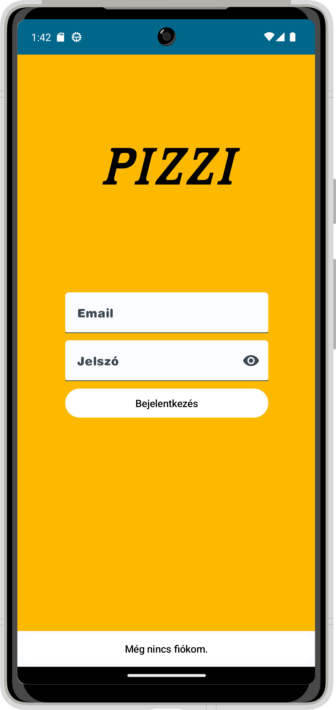
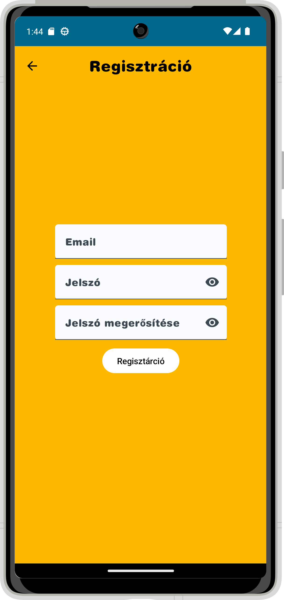
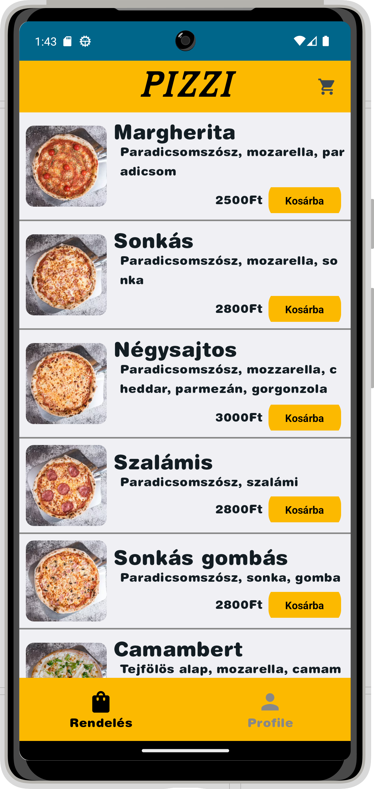
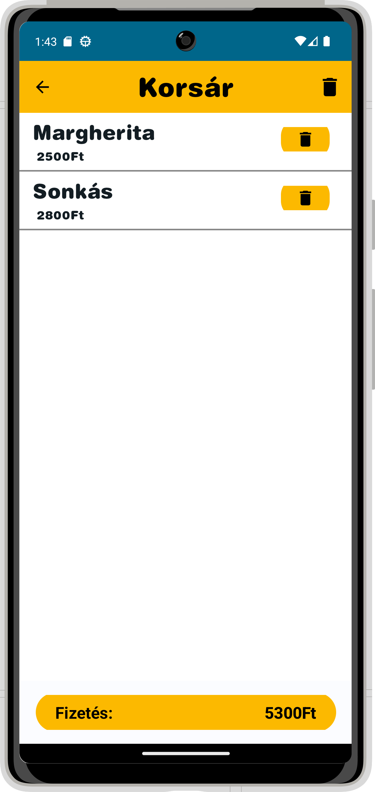
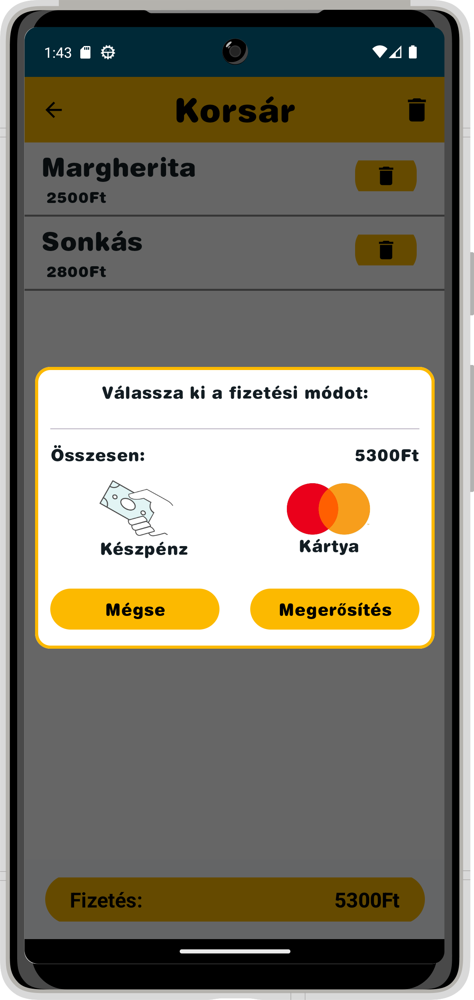
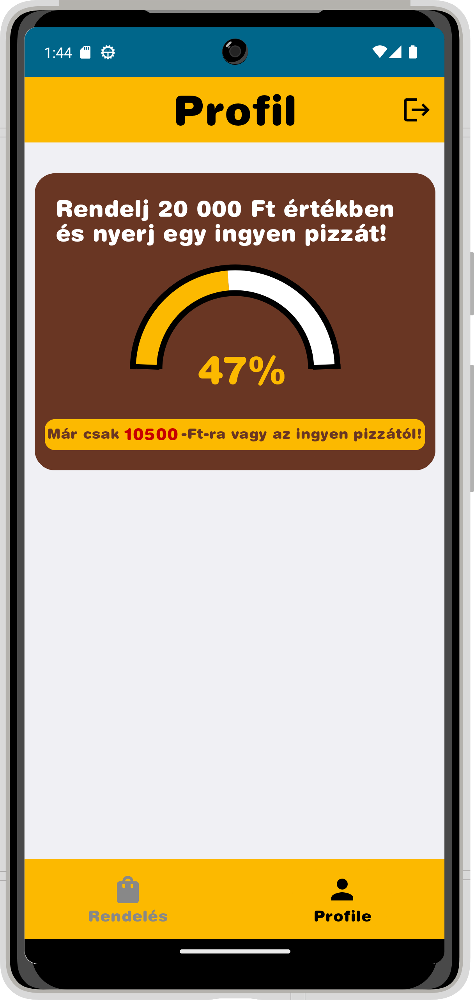
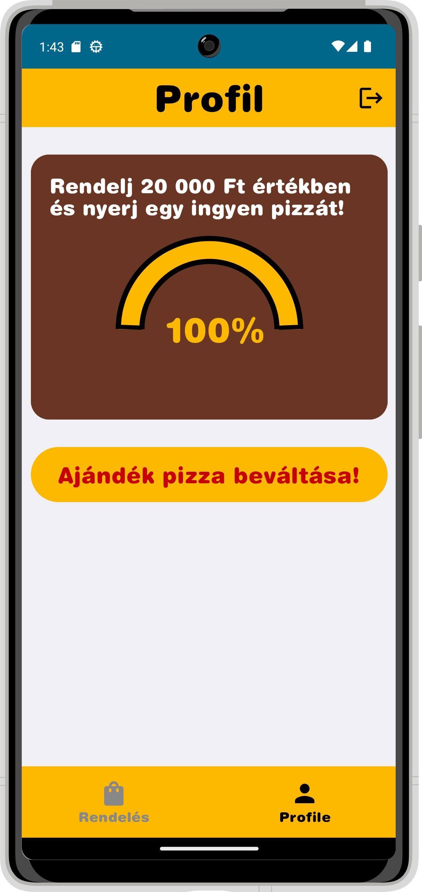

# Házi feladat specifikáció

Információk [itt](https://viauav21.github.io/laborok/hf)

## Androidalapú szoftverfejlesztés
### [Dátum - 2023 1. félév]
### [Kárpáti Péter Milán] - ([VW19BD])
### [petermilankarpati@gmail.com] 
### Laborvezető: [Pásztor Dániel]

## Bemutatás
A házi feladat során megvalósított alkalmazás egy pizzéria alkalmazása lesz, melyben a felhasználó pizzát rendelhet, kuponokat aktiválhat és hűsépontokat szerezhet. Az ötletet az adta, hogy a nagyobb étterem láncoknak mind van saját alkalmazása ezzel szemben a pizzériák általában nem rendelkeznek ilyennel. A célközönség mindenki aki szereti a pizzát 

## Főbb funkciók
Az alkalmazás megnyitásakor a főoldalon előre összeállított pizzák közül tudunk választani.Az alkalmazás alján egy navigátor található ahol a három fő oldal közül választhatunk. Az első menüpont az imént említett előre összeállított pizzákra fókuszáló főoldara visz vissza amennyiben más oldalon vagyunk. Ezen az oldalon a pizzákat hozzá tudjuk adni kosárhoz és amennyiben valamilyen feltétet nem szeretünk a pizzára kattiva áttérünk egy új oldalra ahol eltávolíthatunk és hozzádhatunk feltéteket. A második fő menüpont egy olyan oldalra navigál ahol a felhasználó egy  saját pizzát tud összeállítani, lehetőség van kiválasztani az alapot, a feltéteket és a méretet. A harmadik menüponton a felhasználó korábbi rendelései alapján hűségpontokat kap és a pontjai segítségével kuponokra tehet szert amelyet ezen a menüponton tud beváltani.

## Választott technológiák:
-UI
-perzisztens adattárolás
-animáció
-komplexebb lista
-Firebase

___

# Házi feladat dokumentáció

### [Pizzi]

## Bemutatás

Az alkalmazásom egy pizzéria alkalmazása, melyben a felhasználó pizzákat tud rendelni, a vársárlások alapján pontokat tud gyűjteni. Amennyiben a felhasználó elegendő pontot gyűjt össze, lehetősége van egy ingyen pizza beváltására. Az ötletet az adta, hogy a nagyobb étterem láncoknak van 
saját alkalmazása, ezzel szemben a pizzériák többnyire nem rendelkeznek ilyennel. A célközönség mindenki aki ettől a pizzériától szeretne pizzát rendelni.

## Főbb funkciók

-Bejelentkezés és regisztráció

-Főképernyő az előre összeállított pizzák lisátjával, lehetőség van a pizzák kosárba rakására.

-Alsó navigációs "bar", amely segítségével navigálhatunk a főképernyő és a profil képernyő között. Az ikon színe az alapján változik, hogy melyik képernyő van kiválasztva.

-Top app bar kosár ikonra kattinással navigáció a kosár képrenyőre.

-Kosár elemei összegének kijelzése, korsár elemei egyenkénti törlése, összes elem törlése, fizetés gomb.

-Fizetés gombra felugró ablak, vásárlás megerősítése vagy visszalépés.

-Profil képernyőn animáció a pontok számáról, hátralévő összeg kijelzése.

-Amennyiben a felhasználó elérte a szükséges pontok számást, akkor "ajándék pizza beváltása" gomb megjelenik, megnyomása esetén igyen pizza a kosárban.

## Felhasználói kézikönyv

Az alkalmazás megnyitásakor a bejelentkezési képrenyő fogad minket, amely Firebase Authentication-el van megvalósítva. Az adatok beírása után a bejelentkezés gombra kattinva tudunk továbblépni. Ha rossz adatokat ütöttünk be a képenyő alján hibaüzenetet kapunk. Ha még nincs felhasználói profilunk abban az esetben lehetőség van a regisztrálásra is az alsó "még nincs fiókom" gomb segítségével. A gomb megnyomásával átugrunk a regisztrációs képernyőre, ahol a megfelelő adatok beírásával, majd a regisztráció gomb megnyomásával regisztrálhatunk.

1. ábra: A bejelentkezési és regisztrációs képernyő. A jelszavak alapállapotban kipontozottak, de a szem megnyomásával megjeleníthetőek

A belépés vagy regisztráció gomb megnyomása után a főképernyőre jutunk, ahol előre elkészítettt pizzák listája található. A még nem látható pizzákat lefelé görgetés segítségével érhetjük el. Amennyiben egy pizzát meg szeretnék vásrárolni abban az esetben a "korsárba" gombra kattintva adott pizza bekerül a kosárba. A képernyő alján egy navigátor található, ahol a fő és profil képernyő közül választhatunk. Emellett a top app bar-on található kosár ikon segítségével átnavigálhatunk a kosár képernyőre, ahol a kosár tartalmát tekinthejük meg.

2. ábra: A fő képernyő az előre összeállított pizzákkal a top app bar-on található korár ikonnal és a képernyő alján található navigációs bar-al

A Top app bar-on található kosár ikonra kattintva átnavigálunk a kosár képernyőre, ahol a kosárba helyezett pizzák listáját láthatjuk. Amennyiben mégsem szeretnénk egy pizzát eltávolíthatjuk a korsárból, vagy lehetőségünk van az összes elem eltávolítására is. A képernyő alján láthatjuk a pizzák
teljes összegét. Amennyiben a fizetés gombra kattintunk megjelenik egy felugró ablak, ahol kiválaszthajuk a fizetési módot és megerősíthetjük a vásárlást. Ha mégsem szeretnénk folytatni a vásrálást abban az esetben a "mégse" gombal eltűntethetjük a felugró ablakot. A képernyő bal felső sarkában található egy vissza nyíl, melynek segítségével vissza térhetünk a fő képernyőre.

3. ábra: A kosár képernyő a korsárba helyezett elemekkel. Minden elemen található törlés gomb és a jobb felső sarokban egy minden elemet törlő gomb. A jobb oldali képen a fizetés gombra felugró ablak látható.

Ha a "megerősítés" gombra nyomunk az elköltött összeg hozzáadásra kerül a felhasznláló által költött összeghez. A költött összeg a felhasználói fiókokhoz tartozik. Ezután átnavigál minket a profil képernyőre, ahol egy animáció szemlélteti, mennyire vagyunk még az ingyen pizza elérésétől. A szemléltető vizuális elem alatt található egy szöveg, amely kiírja a pontos összeget, ami még szükséges. Amennyiben a felhasználó eléri az adott összeget megjelenik egy "ajándék pizza beváltása" gomb. Ha a felhasználó a beváltás gombra nyom, a kosárba bekerül egy pizza 0 Ft-os áron és átnavigál a kosárra, emellett a pontok levonásra kerülnek. Ha a felhasználónak többb pontja van, mint a szükséges, abban az esetben a szükséges pontokon felüliek megmaradnak. A profil képernyő top app bar-ján egy kijelentkezés gomb található, amelyet ha megyom a felhasználó kijelentkeztetjük és átnavigálunk a bejelentkezési képrenyőre.

4. ábra: A profil képernyő a félkör alakú vizuális elemmel, alatta a hátrvalévő összeget kiíró szöveggel. A jobb oldali képen az az állapot látható amikor erlértük a szükséges összeget és megjelenik az "ajándék pizza beváltása" gomb.

## Felhasznált technológiák:

-**FireBase Authentication** a belépés és regisztráció biztosítására

-**FireStore Database** a felhasználó pontjai tárolására (adott felhasználói fiókhoz rendelve)

-**SQL Lite (Room Library)** a korsár tartalmának tárolására

-**Animáció** A felhasználó pontjainak kijelzésére

-**UI** Scaffold,Felugró ablak,Toast

-**Lista** az előre meghatározott pizzáknak és a kosárnak

## Fontosabb technológiai megoldások

A legnagyobb problémát a FireStore-ból való adat lekérdezés jelentette. Kezdetben úgy próbálkoztam, hogy pontszámnak legyen egy ID-ja. Ezek a dokumentumok mind a Users collection-ben voltak és minden felhasználóhoz tartozott egy Points subcollection,melyben megtalálhatóak voltak ID-k alapján elnevezett fileok.
Ezzel több probléma is akadt, az egyik az volt, hogy a FireStore adatbázisból érkező adatot nem tudta átalakítani az applikációban található Points classnak megfeleően. Hosszas keresés után kiderült, hogy ez azért volt, mert a point értéknek nem adtam kezdeti értéket. Emellett rájöttem, hogy ebben az esetben mivel minden felhasználóhoz egy pont tartozikm, ezért elegendő minden felhasznói fiókhoz egy User_points dokumentumot rendelni, majd ezt frissíteni. Így végül ezzel a megoldással sikerült megoldani a problémát.
